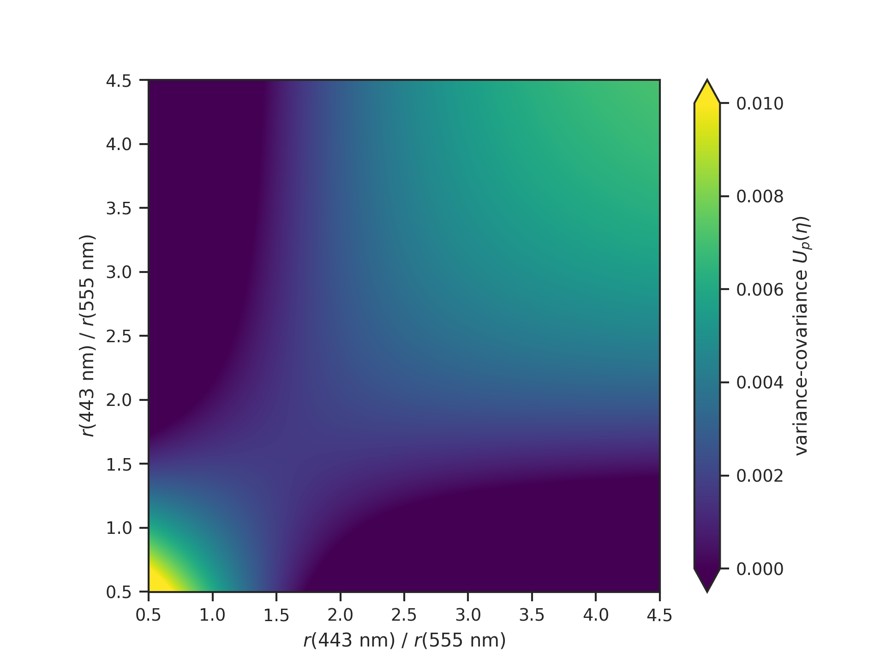

# Context

In an algorithm-driven measurement context, the “measurement models” are
not static laboratory instruments but complex, evolving data-processing
codes. In this setting, the classical [GUM](https://doi.org/10.59161/JCGMGUM-1-2023)
framework—built on assumptions of a fixed analytical model, a fixed data
flow, and manually maintained analytical Jacobians—offers limited practical
guidance. The true forward map is defined by the current state of the code,
which evolves as algorithms, implementations, and data dependencies change.

Algorithmic differentiation (AD) provides a more flexible foundation: it
derives local linearizations directly from the implementation whenever
needed, ensuring that sensitivity information remains consistent with
the code itself. Combined with random sampling methods for strongly 
nonlinear behaviour, AD enables uncertainty propagation to be formulated
in terms of algorithmically differentiable programs.

As the computational backbone of much of modern machine learning, AD
frameworks represent inputs, outputs, and sensitivities as dynamic
tensor-valued objects, freeing the uncertainty calculus from reliance on
fixed closed-form formulas. Moreover, AD allows sensitivities and
uncertainties to be integrated **within** data‑processing codes themselves,
turning them from external annotations into active elements of
computational workflows.

> The concept presented here grew out of earlier, project‑specific
> implementations of AD‑based uncertainty propagation. These implementations
> enabled multi‑mission remote sensing calibration workflows that
> underpin fundamental Earth climate data records.

## Synopsis

**Uncertaintyx** (or just **Tyx**) is a lightweight framework for tensor‑level
uncertainty propagation, fitting of empirical or physics-informed models, and
metrology‑aware workflows. It produces uncertainty tensors by combining
tensor‑valued models with AD backends such as [JAX](https://docs.jax.dev/).
Conventional [NumPy](https://numpy.org)
acts as a bidirectional interoperability layer, enabling JAX‑based code
to interoperate smoothly with existing workflows.

**Why tensors?** Remote sensing imagery provides 2D data, spectral imagers
deliver 3D data, and Earth climate records form 4D datasets—with ocean
and atmosphere data reaching up to 5D. Applying standard matrix-based
uncertainty propagation requires flattening these N-D arrays into 1D
vectors, which obscures the vital spatiotemporal structure of both the
data and the algorithms designed to analyse it. Tensors are the ideal
solution, and the law of propagation of uncertainty, when formulated
and coded in general tensor form, is elegantly beautiful. If you’re curious,
compare [NIST TN 1297](https://www.nist.gov/pml/nist-technical-note-1297/nist-tn-1297-appendix-law-propagation-uncertainty) (Equation A-3)
with the tensor equation and code further below.

**Why JAX?** Traditional methods like finite differences, manual Jacobians,
or Monte Carlo often struggle with scalability for high-dimensional
tensors, demanding extensive evaluations or approximations that compromise
fidelity. Frameworks like JAX, facilitating GPUs and TPUs besides CPUs,
make  differentiation a game changer, automatically generating
exact derivatives—even for complex, nonlinear models—at machine precision
to produce Jacobians and Hessians seamlessly. This approach efficiently
propagates full covariance structures while honouring spatiotemporal
correlations.

**How does it work?** You define and code a function that maps from one
tensor space to another:

$$
f: \mathbb{R}^{m_1 \times \cdots \times m_{N_m}} \to 
\mathbb{R}^{n_1 \times \cdots \times n_{N_n}}, \quad
f(x) \mapsto y
$$

Here, $x$ and $y$ may be scalars, vectors, matrices, or higher-order
tensors of arbitrary shape. The function may also depend on parameters 
$p$, which themselves can be tensors of arbitrary shape:

$$
f: \mathbb{R}^{k_1 \times \cdots \times k_{N_k}} \times 
\mathbb{R}^{m_1 \times \cdots \times m_{N_m}} \to 
\mathbb{R}^{n_1 \times \cdots \times n_{N_n}}, \quad
f(p, x) \mapsto y
$$

**Tyx** extends this formulation by introducing a batch dimension
$M \in \mathbb{N}$ into the function signature:

$$
f: \mathbb{R}^{k_1 \times \cdots \times k_{N_k}} \times 
\mathbb{R}^{M \times m_1 \times \cdots \times m_{N_m}} \to 
\mathbb{R}^{M \times n_1 \times \cdots \times n_{N_n}}, \quad
f(p, X) \mapsto Y
$$

The main objective of Tyx is to provide efficient access to
uncertainty tensors for such functions. While Jacobians themselves
are obtained through automatic differentiation (using JAX),
Tyx delivers a high-level interface, utilities, and structured
handling for them. These Jacobians form the foundation for parameter
estimation, sensitivity analysis, and uncertainty propagation within
the framework.

The **single-input tensor paradigm** is lightweight and modern,
following the design principles of leading machine learning frameworks.
By accepting a single input tensor of arbitrary shape, the model
remains both flexible and conceptually clean—supporting multiple
logical inputs without cluttering the function signature. Organizing
and assembling these logical inputs into a unified tensor structure is
the user’s responsibility. In this role, you serve as the *Thalamus*—the
interface channelling structured data into the computational core
of **Tyx**.

> The batch dimension $M$ enumerates independent samples (e.g.,
> sensor scans, simulations, ensemble members) but you get to define
> what “one sample” is: a single pixel value, a spectrum, a scan line,
> or a spatiotemporal cubelet. **Tyx** treats that single sample as
> a tensor $x$, and the framework scales it to a batch $X$ of $M$ such
> samples. Many remote‑sensing workflows implicitly assume “one sample
> is one pixel”, but this is often an oversimplification that obscures
> the full structure of the data and its uncertainties.

## Law of propagation of uncertainty

Using Einstein's summation convention and the symmetry of the
input uncertainty tensor $U$, the law of propagation of uncertainty
in general tensor form reads:

$$V_{\dots ij} = G_{\dots ik} U_{\dots lk} G_{\dots jl},$$

with multi-indices $k, l \in D \subset \mathbb{N}^d$ for some
$d \in \mathbb{N}$. The summation is taken over all $k, l \in D$.
Here, $D$ denotes the set of inner tensor indices (multi-indices
of length $d$), and the trailing tensor dimensions of the Jacobian
tensor $G$ and the input uncertainty tensor $U$ correspond to
these indices. The code below provides an implementation. 

```python
def make_lpu(d: int) -> Callable[[Array, Array], Array]:
    """
    Returns the law of propagation of uncertainty.

    :param d: The number of inner tensor dimensions.
    :returns: The law of propagation of uncertainty.
    """

    @jax.jit
    def lpu(g: Array, u: Array) -> Array:
        r"""
        The law of propagation of uncertainty.

        :param g: The Jacobian tensor :math:`G`.
        :param u: The uncertainty tensor :math:`U`.
        :returns: The uncertainty tensor :math:`V`.
        """
        dims = tuple(range(-d, 0))
        return jnp.tensordot(jnp.tensordot(g, u, (dims, dims)), g, (dims, dims))

    return lpu
```


[](https://github.com/bcdev/uncertaintyx/actions/workflows/codeql.yml)
[](https://github.com/bcdev/uncertaintyx/actions/workflows/python-package.yml)
[](https://codecov.io/gh/bcdev/uncertaintyx)

<script>
MathJax = {
  tex: {
    inlineMath: [['$', '$'], ['\\(', '\\)']]
  }
};
</script>
<script id="MathJax-script" async
  src="https://cdn.jsdelivr.net/npm/mathjax@3/es5/tex-chtml.js">
</script>
