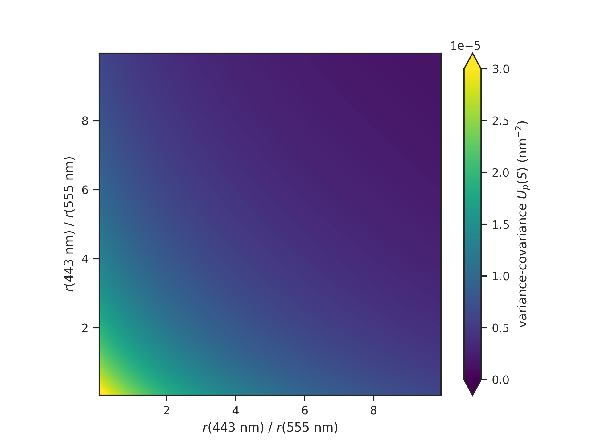

# Uncertaintyx

In an algorithm‑centric world, the “measurement devices” are complex, 
evolving data‑processing codes rather than static laboratory 
instruments. In this setting, the classical [GUM](https://doi.org/10.59161/JCGMGUM-1-2023)
equations, which assume a fixed analytical model, a fixed data flow,
and hand‑managed analytical Jacobians, offer limited practical help: the
true forward map is the current state of the code, and this changes as
algorithms, implementations, and dependencies evolve. Algorithmic
differentiation (AD) provides a better foundation because it derives local
linearizations directly from the implementation whenever needed, so sensitivity
information automatically stays consistent with the code. Combined with random
sampling methods for strongly nonlinear behaviour, this defines uncertainty
propagation in terms of algorithmically differentiable programs. AD frameworks
treat inputs, outputs, sensitivities, and uncertainties as dynamic tensor‑valued
objects rather than forcing the uncertainty calculus into a fixed set of
closed‑form formulas.

The concept presented here grew out of earlier project-specific implementations
of AD-based uncertainty propagation for multi-mission sensor calibration
workflows underpinning fundamental Earth climate data records.

## Synopsis

**Uncertaintyx** is a lightweight framework for tensor‑level uncertainty
propagation, fitting of empirical or physics-informed models, and
metrology‑aware workflows. It produces uncertainty tensors by combining
tensor‑valued models with AD backends such as [JAX](https://docs.jax.dev/).
Conventional [NumPy](https://numpy.org)
acts as a bidirectional interoperability layer, enabling JAX‑based code
to interoperate smoothly with existing workflows.

**Why tensors?** Remote sensing imagery provides 2D data, spectral imagers
deliver 3D data, and Earth climate records form 4D datasets—with ocean
and atmosphere data reaching up to 5D. Applying standard matrix-based
uncertainty propagation requires flattening these N-D arrays into 1D
vectors, which obscures the vital spatiotemporal structure of both the
data and the algorithms designed to analyse it. Tensors are the ideal
solution, and the law of propagation of uncertainty, when formulated
and coded in general tensor form, is elegantly beautiful. If you’re curious,
compare [NIST TN 1297](https://www.nist.gov/pml/nist-technical-note-1297/nist-tn-1297-appendix-law-propagation-uncertainty) (Equation A-3)
with the tensor equation and code further below.

**Why JAX?** Traditional methods like finite differences, manual Jacobians,
or Monte Carlo often struggle with scalability for high-dimensional
tensors, demanding extensive evaluations or approximations that compromise
fidelity. Frameworks like JAX, facilitating GPUs and TPUs besides CPUs,
make  differentiation a game changer, automatically generating
exact derivatives—even for complex, nonlinear models—at machine precision
to produce Jacobians and Hessians seamlessly. This approach efficiently
propagates full covariance structures while honouring spatiotemporal
correlations.

**How does it work?** You define and code a function that maps from one
tensor space to another:

$$
f: \mathbb{R}^{m_1 \times \cdots \times m_{N_m}} \to 
\mathbb{R}^{n_1 \times \cdots \times n_{N_n}}, \quad
f(x) \mapsto y
$$

Here, $x$ and $y$ may be scalars, vectors, matrices, or higher-order
tensors of arbitrary shape. The function may also depend on parameters 
$p$, which themselves can be tensors of arbitrary shape:

$$
f: \mathbb{R}^{k_1 \times \cdots \times k_{N_k}} \times 
\mathbb{R}^{m_1 \times \cdots \times m_{N_m}} \to 
\mathbb{R}^{n_1 \times \cdots \times n_{N_n}}, \quad
f(p, x) \mapsto y
$$

**Uncertaintyx** extends this formulation by introducing a batch
dimension $M \in \mathbb{N}$ into the function signature:

$$
f: \mathbb{R}^{k_1 \times \cdots \times k_{N_k}} \times 
\mathbb{R}^{M \times m_1 \times \cdots \times m_{N_m}} \to 
\mathbb{R}^{M \times n_1 \times \cdots \times n_{N_n}}, \quad
f(p, X) \mapsto Y
$$

The main objective of Uncertaintyx is to provide efficient access
to Jacobian tensors for such functions. While Jacobians themselves
are obtained through automatic differentiation (using JAX),
**Uncertaintyx** delivers a high-level interface, utilities,
and structured handling for them. These Jacobians form the foundation
for parameter estimation, sensitivity analysis, and uncertainty
propagation within the framework.

The **single-input tensor paradigm** is lightweight and modern,
following the design principles of leading machine learning frameworks.
By accepting a single input tensor of arbitrary shape, the model
remains both flexible and conceptually clean—supporting multiple
logical inputs without cluttering the function signature. Organizing
and assembling these logical inputs into a unified tensor structure is
the user’s responsibility. In this role, you serve as the *Thalamus*—the
interface channelling structured data into the computational core
of Uncertaintyx. 

> [!NOTE]
> The batch dimension $M$ enumerates independent samples (e.g.,
> sensor scans, simulations, ensemble members) but you get to define
> what “one sample” is: a single pixel value, a spectrum, a scan line,
> or a spatiotemporal cubelet. Uncertaintyx treats that single sample as
> a tensor $x$, and the framework scales it to a batch $X$ of $M$ such
> samples. Many remote‑sensing workflows implicitly assume “one sample
> is one pixel”, but this is often an oversimplification that obscures
> the full structure of the data and its uncertainties.

## Law of propagation of uncertainty

Using Einstein's summation convention and the symmetry of the
input uncertainty tensor $U$, the law of propagation of uncertainty
in general tensor form reads:

$$V_{\dots ij} = G_{\dots ik} U_{\dots lk} G_{\dots jl},$$

with multi-indices $k, l \in D \subset \mathbb{N}^d$ for some
$d \in \mathbb{N}$. The summation is taken over all $k, l \in D$.
Here, $D$ denotes the set of inner tensor indices (multi-indices
of length $d$), and the trailing tensor dimensions of the Jacobian
tensor $G$ and the input uncertainty tensor $U$ correspond to
these indices. The code below provides an implementation. 

    def propagate(d: int, g: np.ndarray, u: np.ndarray) -> np.ndarray:
        r"""
        Default implementation of the law of propagation of uncertainty
        in general tensor form.
    
        Using Einstein's summation convention and the symmetry of the
        input uncertainty tensor :math:`U`, the output uncertainty
        tensor reads:
    
        .. math::
            V_{\dots ij} = G_{\dots ik}U_{\dots lk}G_{\dots jl}
    
        with multi-indices :math:`k, l \in D \subset \mathbb{N}^d`
        for some :math:`d \in \mathbb{N}`. The summation is taken over
        all :math:`k, l \in D`.
    
        Here, :math:`D` denotes the set of inner tensor indices
        (multi-indices of length :math:`d`), and the trailing tensor
        dimensions of :math:`G` and :math:`U` correspond to these
        indices.
    
        In what follows, we write :math:`\mathbb{R}^{\cdots \times D}`
        for a tensor space whose trailing indices are labelled by the
        index set :math:`D`.
    
        :param d: The number of inner tensor dimensions.
        :param g: Jacobian tensor :math:`G \in \mathbb{R}^{\cdots \times D}`.
        :param u: Uncertainty tensor :math:`U \in \mathbb{R}^{\cdots \times D}`.
        :returns: Uncertainty tensor :math:`V \in \mathbb{R}^{\cdots}`.
        """
        dims = tuple(range(-d, 0))
        return np.tensordot(
            np.tensordot(g, u, axes=(dims, dims)), g, axes=(dims, dims)
        )
  

